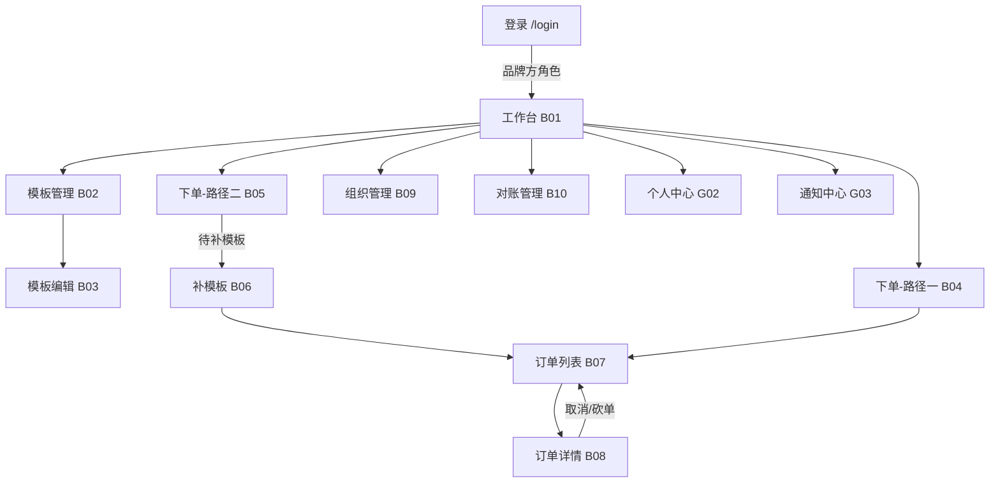
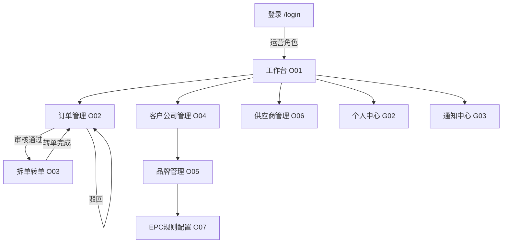
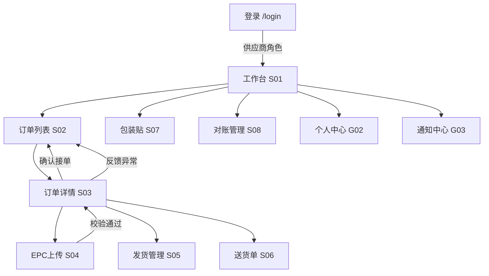

# 页面清单与信息架构

## 一、页面清单

### 通用页面（3 页）

| 编号 | 页面 | 路由 | 说明 |
|------|------|------|------|
| G01 | 登录 | /login | 账号密码登录，按角色跳转 |
| G02 | 个人中心 | /profile | 修改密码、绑定手机/邮箱 |
| G03 | 通知中心 | /notifications | 通知列表，已读/未读 |

### 品牌方端（9 页）

| 编号 | 页面 | 路由 | 说明 |
|------|------|------|------|
| B01 | 工作台 | /brand/dashboard | 订单概览卡片、待处理提醒 |
| B02 | 模板管理 — 列表 | /brand/templates | 模板表格、名称搜索、SKU搜索（AutoComplete自动提示）、类型筛选、新建；使用说明书按钮位于标题栏右侧 |
| B03 | 模板管理 — 编辑 | /brand/templates/:id | 模板基本信息 + 字段编辑 |
| B04 | 下单（路径一） | /brand/order/new?mode=template | 选类型 → 自动匹配模板 → 填SKU与数量（含模板预览入口）→ 收货信息与确认（含上一步按钮）→ 提交 |
| B05 | 下单（路径二） | /brand/order/new?mode=manual | 填 SKU+数量+收货信息 → 提交待补模板 |
| B06 | 补模板 | /brand/orders/:id/template | 打单员为待补模板订单创建/选择模板 |
| B07 | 订单列表 | /brand/orders | 表格、状态筛选、日期范围筛选、操作按钮 |
| B08 | 订单详情 | /brand/orders/:id | 订单信息、订单进度（含各节点时间）、SKU明细（含模板图稿预览+数据来源）、取消/砍单；已去掉操作记录和工厂字段 |
| B09 | 组织管理 | /brand/factories | 采购账号管理（新增/编辑/权限配置）、工厂列表查看（品牌方只读）；无使用说明书 |
| B10 | 对账管理 | /brand/billings | 对账单列表、确认、导出 Excel、下载发票 |

### 平台方端（7 页）

| 编号 | 页面 | 路由 | 说明 |
|------|------|------|------|
| O01 | 工作台 | /ops/dashboard | 统计卡片：待审核、今日转单、异常 |
| O02 | 订单管理 | /ops/audit | 审核列表、审核通过/驳回、取消、砍单、转供应商、批量操作、订单详情（物流追踪、进度条） |
| O03 | 订单详情 | /ops/orders/:id | 订单信息、子订单进度、物流时间线、发货批次表 |
| O04 | 客户公司管理 | /ops/customers | 客户公司列表、新增、`allow_brand_switch` 开关配置 |
| O05 | 品牌管理 | /ops/brands | 品牌方列表（按客户公司分组）、新增、EPC 规则配置入口 |
| O06 | 供应商管理 | /ops/suppliers | 供应商列表、新增、停用 |
| O07 | EPC 规则配置 | /ops/epc-rules | 品牌维度 EPC 规则 CRUD、编码方案速查、使用说明书 |
| O08 | 配置管理 | /ops/config | 平台级配置中心，含 4 个子页面：系统配置（平台名称/文件上限/超时/通知开关）、业务配置、品牌方配置（按品牌开关采购账号Tab/工厂管理Tab可见性及创建权限）、供应商配置 |

### 供应商端（8 页）

| 编号 | 页面 | 路由 | 说明 |
|------|------|------|------|
| S01 | 工作台 | /supplier/dashboard | 待接单数、生产中数、待发货数卡片 |
| S02 | 订单列表 | /supplier/orders | 表格、状态筛选、日期范围筛选 |
| S03 | 订单详情 | /supplier/orders/:id | 订单信息、图稿预览、核对清单、确认接单 |
| S04 | EPC 数据上传 | /supplier/orders/:id/epc | 文件拖拽上传、校验结果展示 |
| S05 | 发货管理 | /supplier/orders/:id/ship | 填写发货信息、发货记录列表 |
| S06 | 送货单 | /supplier/orders/:id/delivery-note | 生成/下载送货单 |
| S07 | 包装贴 | /supplier/package-labels | 选择类型下载 |
| S08 | 对账管理 | /supplier/billings | 对账单列表、确认 |

---

## 二、页面跳转流程图

### 2.1 品牌方端



### 2.2 平台方端



### 2.3 供应商端



---

## 三、全局导航结构

### 品牌方端侧边导航

```
🏠 工作台
📋 订单管理
   ├── 创建订单
   │   ├── 模板下单
   │   └── 即时下单
   └── 订单列表
🏷️ 模板管理
🏭 组织管理
💰 对账管理
```

> **品牌切换器**：当客户公司配置了 `allow_brand_switch = true` 时，品牌方顶栏显示品牌切换下拉菜单，切换后页面数据上下文（模板、订单、工厂）跟随当前品牌。

### 平台方端侧边导航

```
🏠 工作台
📋 订单管理
   └── 拆单转单（从审核列表进入）
🏢 客户公司管理
   └── 品牌管理（按客户公司展开）
       └── EPC 规则配置
⚙️ 配置管理
   ├── 系统配置
   ├── 业务配置
   ├── 品牌方配置
   └── 供应商配置
🔧 供应商管理
```

### 供应商端侧边导航

```
🏠 工作台
📋 订单管理
   └── 订单列表
📦 发货管理（从订单详情进入）
🖨️ 包装贴下载
💰 对账管理
```
